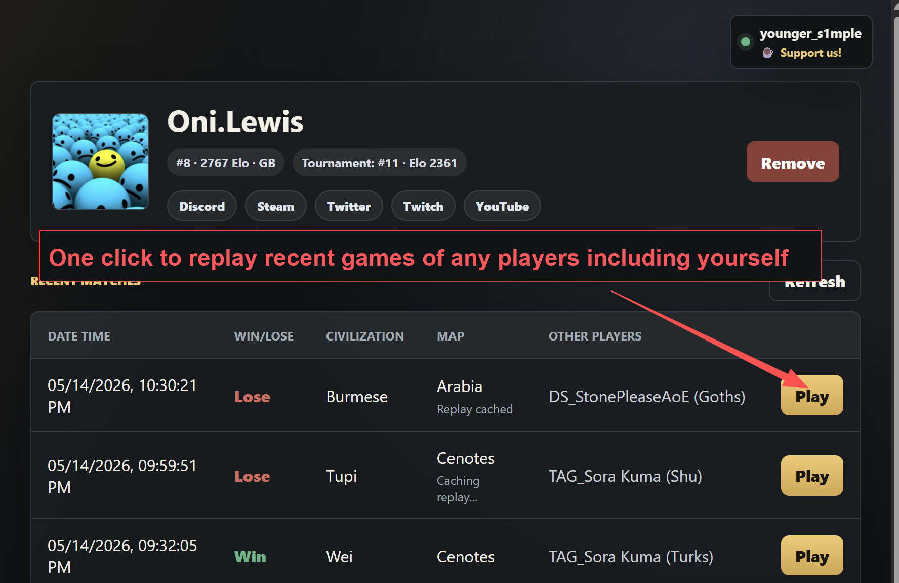
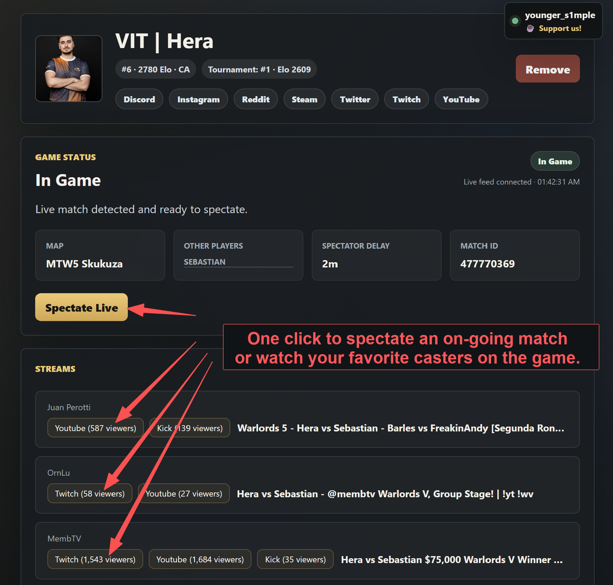
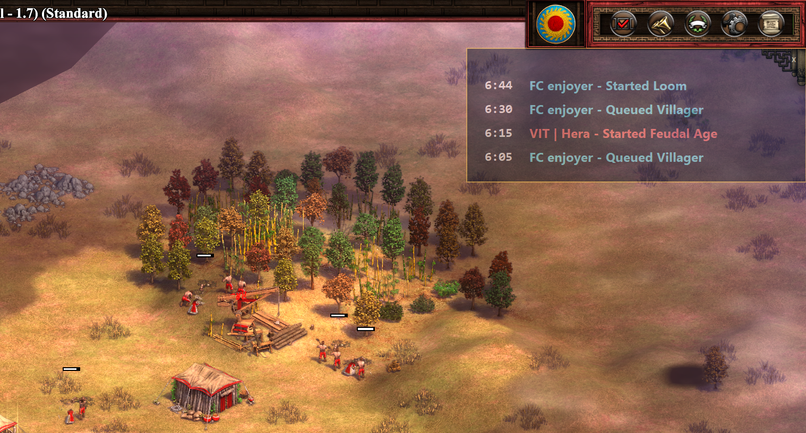
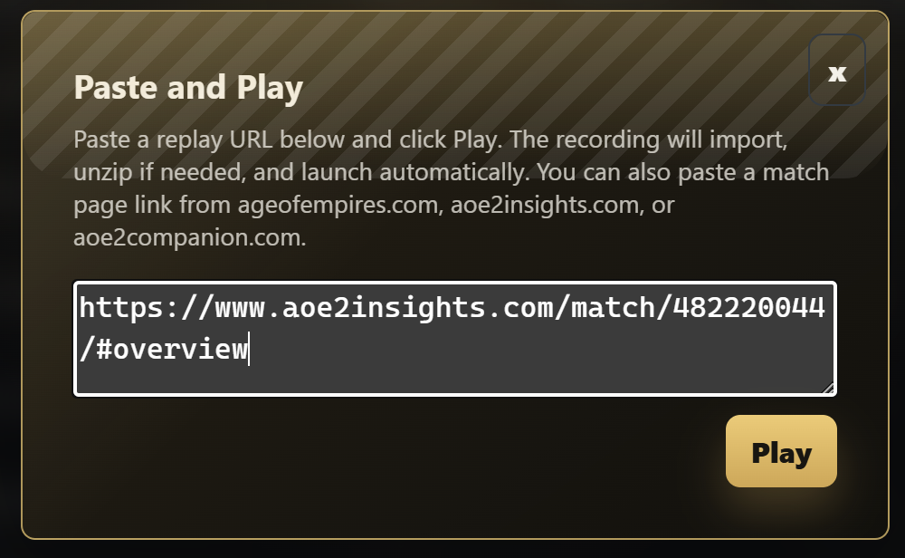

# AOE2 game viewer

AOE2 game viewer is a Windows app for Age of Empires II: Definitive Edition players and spectators. Follow players, launch recent replays, spectate important matches in-game, and pick from caster streams covering the match.

## Download

[Download AOE2 game viewer for Windows](https://downloads.aoe2viewer.com/releases/AOE2-game-viewer-x64-Setup.exe)

Current version: `2.7.4`

## Auto Update

The app checks `https://downloads.aoe2viewer.com/releases/latest.json` on startup. Publish the newest installer as `AOE2-game-viewer-x64-Setup.exe` beside that JSON file so older app versions can download and run the current installer.

For local update testing, point the app at another manifest:

```powershell
$env:AOE2_VIEWER_UPDATE_MANIFEST_URL="C:\path\to\latest.json"; npm start
```

Prepare a new release build with:

```powershell
node release/pre-release.js
```

With no argument, the script increments the patch component of the version in `package.json` (for example, `2.7.3` becomes `2.7.4`). Pass an explicit `x.y.z` version when a different release number is needed.

Upload the installer and manifest with:

```powershell
node release/release.js
```

## Website

The project website is available at [https://aoe2viewer.com](https://aoe2viewer.com).

## Setup

Install the root app dependencies:

```powershell
npm install
```

The Cloudflare Worker backend lives in `server/` and has its own README and dependencies.

## Run

Start the Electron app:

```powershell
npm start
```

Start with Electron debug logging:

```powershell
npm run start:debug
```

Replay auto-caching is disabled by default. To opt into the old behavior that quietly downloads recent replays in the background:

```powershell
npm start -- --auto-cache-replays
```

## Localization Debugging

The app normally detects the Windows GUI language, falls back to English when unsupported, and can also use the saved in-app language override.

For localization testing, force a temporary language from the command line:

```powershell
npm start -- --debug-locale=ja
```

The same flag works with debug mode:

```powershell
npm run start:debug -- --debug-locale=zh-Hans
```

You can also pass the locale as the next argument:

```powershell
npm start -- --debug-locale fr
```

`--debug-locale` takes priority over the saved language override and Windows language detection for the current app launch only. Supported locale codes are `en`, `pt`, `de`, `es`, `fr`, `hi`, `it`, `ja`, `ko`, `ms`, `ru`, `tr`, `zh-Hant`, `vi`, `zh-Hans`, and `pl`.

## Checks

Run the JavaScript syntax checks:

```powershell
npm run check
```

## Community

- [Discord](https://discord.gg/YjW9tz4tty)
- [GitHub repository](https://github.com/dallascao/aoe2-game-viewer)

## Data sources

AOE2 game viewer draws match, live, rating, and player profile data from:

- [Age of Empires stats](https://www.ageofempires.com/stats/ageii/)
- [aoe2recs](https://aoe2recs.com/)
- [AOE Elo](https://aoe-elo.com/)
- [Liquipedia Age of Empires](https://liquipedia.net/ageofempires/Main_Page)

## Screenshots

### Replay recent games



### Spectate matches and find casters



### Synced event overlay



### Paste 'n Play!



## Features

- Replay any player's recent games, including your own, with one click from a clear match history list.
- Avoid searching, downloading, unzipping, copying, or guessing which recorded-game file to open.
- Spectate important matches in-game or choose from a list of caster streams covering them.
- Show synced build, economy, and age-up events over the game view.
- Detect each 1v1 player's opening strategy and Castle Age followup from replay data. Opening detection includes water compositions after multiple Dark Age docks and Cuman-specific `Second feudal town center` and `Feudal ram push` strategies. Followups use the first two military groups to reach five units in Castle Age, collapse Castle-produced units to `Unique Units` and Siege Workshop units to `Siege`, and prefer qualifying military groups over `Booming`; other outcomes include `Fast Imperial`, `Defensive`, `Not applicable`, and `Unknown`.
- Paste a shared game link and launch the replay with Paste 'n Play.
- Share games with friends more easily.
- Browse and manage local saved games from one place.
- Supports multiple website languages and localized screenshot captions.

## Platform

AOE2 game viewer currently targets Windows and Age of Empires II: Definitive Edition.

## AOE2 official download api
https://aoe.ms/replay/?matchId=482220633&profileId=2920057
https://api.ageofempires.com/api/GameStats/AgeII/GetMatchReplay/?matchId=482966933&profileId=25434928
